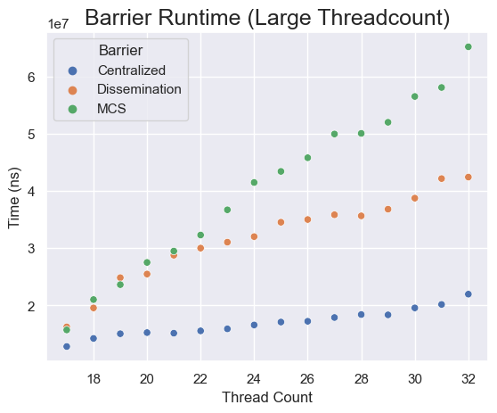

# Reed CS389: Barrier Implementation and Analysis

## Code Tour

I apologize for the general messiness of some of the code.

The barriers only work with optimizations turned off; otherwise I think it
optimizes out the spinning, or something similar. The make targets should set
the correct flags for you.

The file `barrier.h` contains an interface for a barrier, with setup and
teardown methods. There are three barrier implementations, `centralized.c`, `dissemination.c`, and `mcs.c`.

The file `test.c` links against a barrier implementation and contains test code
abstracted over the implementation.

The file `bench.c` runs a simple benchmark (create p threads and run them
through 100 barriers) 10 times, averaging the results. This is plotted by the
`plot.py` python file; running this depends on `poetry` for python
virtualization.

The `overhead.c` file contains an empty implementation of `barrier.h` for the
purpose of calculating loop overhead.

## Correctness

### Testing

There are four automated tests, contained in the `test.c` file. They can be run
with the `test` make target, which links the test object file against all three
barrier implementation files and runs the resulting executables. I'll note that
the code in this file is pretty messy; I'm not super familiar with paradigmatic
C and so I end up reusing a lot of code across tests for setting up thread
states, counters, etc.

`test_waw` spins two threads. Thread 0 sleeps for a second, writes a shared
variable to `1`, and then enters the barrier. Thread 1 enters the barrier and
then writes the shared variable to `2`. The main test function then asserts that
the variable is `2` after joining both threads. This tests the simple guarantee
that writes after a barrier resolve after writes before a barrier.

`test_raw` resets a global variable to `false` and then spins an arbitrary
number of threads. Each of these threads asserts that the global variable is
`true`, enters the barrier, and then writes the global to be `true`. If any of
the writes execute before any of the reads, the test will fail. This tests the
guarantee that writes after the barrier execute before reads before the barrier.

`test_twob` tests two threads with two barriers in sequence. Thread 0 writes a 1
to a global variable, then goes through both variables, then asserts the global
variable is 2, then writes it to 3. Thread 1 enters the first barrier, then
asserts the counter is 1, then writes it to 2, then enters the second barrier.
The main thread asserts it is 3 after joining both threads. This is a simple
test of memory sequencing guarantees across multiple barriers; in particular, it
tests the sense/parity implementations.

`test_manyb` tests many threads (the global `N_BARRIERS`) with many barriers in
sequence. It works similarly to `test_raw`: at barrier `N`, each thread asserts
that the global counter is `N`, enters the barrier, sleeps for a random amount
of time, and then writes the counter to `N+1`. If any thread executed any
instruction after the barrier before any thread executed any instruction before
the barrier, then the later thread would fail its assertion. The test file runs
this for every thread count up to 32.

These tests are of course not exhaustive, but they give me reasonably high
confidence in the guarantees made by the barriers, at least for simple cases.

## Performance Analysis

Here is a simple log plot of threadcount vs time:

The key thing to note from this plot is that there is a large jump in runtime at
`p = 17` threads; this is because my machine has 16 cores, and so the scheduler is
able to run each pthread on a separate core for `p <= 16`. While running the
benchmarks, I did my best to quiet my machine (closing daemons, etc), except for
a system monitor, which did record 100% CPU utilization for nearly the entirety
of the benchmark.

There is significant overhead associated with the loop. This next plot shows the
overhead overlaid on top of the barrier runtimes:

I'll analyze the case `p <= 16` separately from the case `p > 16`, since the
scheduler works so differently on each case.

### Small threadcounts

Here is the same graph as above, but only the datapoints for the `p <= 16` case,
and no longer on a log scale:

The loop overhead has a fairly large effect here, and in some cases the do
nothing "barrier" even takes longer to run than other barriers; clearly the
barriers have little effect in this case. This makes sense, since as
mentioned the scheduler is able to give each thread a separate process,
meaning there is little to no competition for shared resources.

Here is the residual runtime when subtracting off the overhead:

Because for some cases the measured loop overhead happened to be larger than the
barrier runtime, some of these values are negative.

As expected, the centralized barrier performs well for small
threadcounts, when spinning is less punished. The MCS barrier performs the
worst; the higher constants from the double tree structure dominate the
asymptotic optimality.

### Large threadcounts

Here is the runtime for `p > 16` (notice that the y axis is in
units of 1e7 ns; I'm not super happy with how seaborn displays that fact):

Here it's much less likely we're seeing noise, because the overhead is so small
in relation to the barrier time. It's clear that we're paying a significant cost
for synchronization here, as the scheduler has to repeatedly stop running one
thread on a given core and switch to another on the same core, whereas for
smaller `p` it was able to just give each thread a core and let them run.

At first, I thought that this is still not a sufficiently high threadcount for
the constant spinning in a centralized barrier to represent a significant cost.
However, here is the same plot for thread counts in powers of 2 up to 4096, but
running only one iteration of 10 barriers, just to make the measurement feasible:

I see three options:

1. You need even higher values of `p` for the asymptotic behavior to dominate
   the constants. I find this unlikely.
2. There are performance issues with my implementations of MCS and
   dissemination. I've spent a little while analyzing them searching for the
   issues unsuccessfully, but I think it's decently likely this is the issue.
3. In the specific case of process threads repeatedly running barriers (and so
   in particular, no IO or network bounding, so the threads constantly take 100%
   CPU), there's not a large penalty for spinning in centralized barriers,
   because the scheduler is good at determining which thread is able to make
   progress without needing to consistently poll spinning threads. This is just
   a theory; to test it, we'd need to make these threads perform IO-bound work
   that doesn't let individual threads use 100% of the cpu, and compare the
   performance of these barriers under those conditions. If this is the case, it
   might indicate that for this kind of CPU-bound work the most important thing
   to optimize for is the scheduler's ability to schedule threads which are able
   to make progress. It might be interesting to look for a way to trace a CPU's
   active processes over time to get a lower-level view of the scheduler.

Regardless, I think the major takeaway from this analysis is that for pthreads
in particular there is a huge performance penalty for running more threads than
the number of cores available, especially when the threads are performing
CPU-intensive operations without waiting for network or disk resources.
